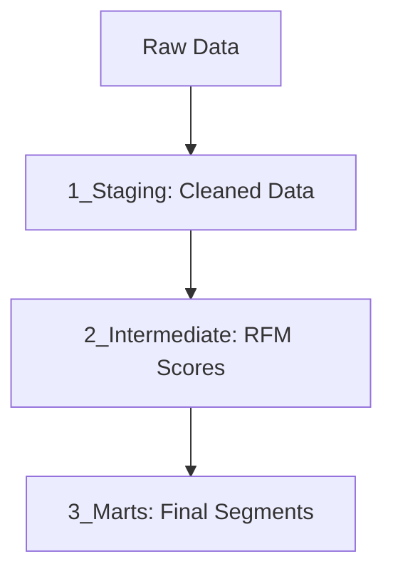

# Customer Purchase Behavior: RFM Segmentation Pipeline

This is a SQL-based project where I built a data pipeline to analyze how customers are buying products. The main goal was to take raw, messy purchase data and turn it into something a marketing team could actually use to target different customer groups.

### How I Structured the Project
I used the "Medallion Architecture" to keep everything organized. Instead of doing all the math in one giant file, I broke it into three steps:

1. **Staging (`1_staging`):** - I noticed the raw data had some missing values (NULLs) for Age and Income. 
   - Instead of just deleting those rows, I wrote SQL logic to fill those gaps with average values so the rest of the data stayed useful.
   
2. **Intermediate (`2_intermediate`):** - This is where the heavy lifting happens. 
   - I calculated the "RFM" values: Recency (last purchase date), Frequency (how often they buy), and Monetary (total money spent).
   - I used the `NTILE` function to rank customers on a scale of 1 to 5.

3. **Marts (`3_marts`):** - The final output. I created a table that labels customers as "Champions," "At Risk," or "Loyal" based on their total scores.

### Why this matters
By the end of the pipeline, you can clearly see which customers are the most valuable and which ones haven't shopped in a while and might need a discount code to come back.

### Skills Used
* **Data Cleaning:** Handling NULL values and formatting dates.
* **SQL Logic:** Using CTEs (WITH statements), Case logic, and Window functions.
* **Project Organization:** Keeping code modular and easy to read.
